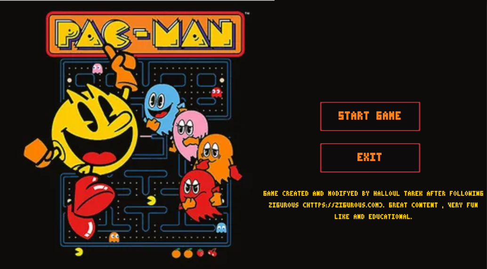
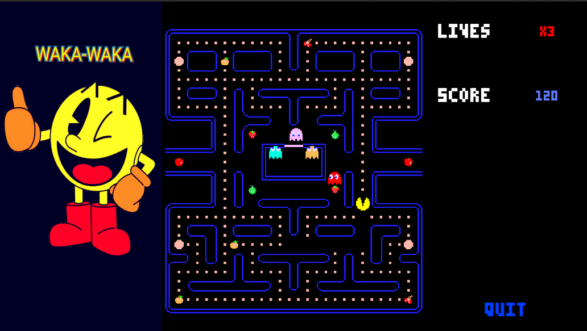

# PACMAN GAME

This is a simple Unity Tilemap based pacman project.

### Gameplay

It composed of a simple UI : 

The gameplay is as every pacman game should be, true to the spirit of retro-arcade games :

Its a simple project using tilemaps, tile rules, coroutines and the same old OOP concept. 

